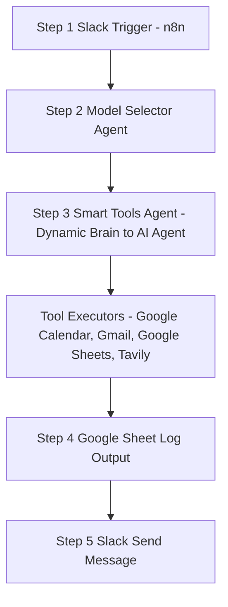

# 📘 Dynamic Brain — AI Model Routing Project


---

## 🔍 Overview

*If you've ever wondered which AI model to use for your agents, and you're tired of wasting credits or overpaying for basic tasks, then this project is for you.*

**Dynamic Brain** is a project where an **AI agent automatically selects the most suitable model based on the input task.**
This ensures:

* 💰 **Cost efficiency**
* ⚡ **Performance boost**
* 👀 **Full transparency**

Instead of manually picking a model, **Dynamic Brain lets the AI decide.**

---

## 🖼️ Workflow Image


---

## 📝 Mermaid Diagram



---

## ⚙️ Node-by-Node Configuration

### Step 1: Slack Trigger (Trigger Node)

* **Description**: Receives messages from Slack (bot/app mentions) and forwards the raw Slack blocks into the flow.
* **Key settings / Parameters**:

  * Webhook URLs
  * Credential: `AIS Stuff`
  * Signing secret recommended
  * Trigger On: Bot / App Mention (Watch Whole Workspace)
  * Channel to Watch: `n8n-stuff` (select from list)
  * Options: No properties, Add Field

---

### Step 2: Model Selector Agent (AI Agent)

* **Description**: Lightweight agent that inspects the user message and returns **only the exact model name** that should handle the request. It must return a single string — one of the allowed model names — and nothing else.

* **Source for Prompt**

  * `{{ $json.blocks[0].elements[0].elements[1].text }}`

* **System Message (exact)**

```
# Overview
You are an AI agent responsible for selecting the most suitable large language model to handle a given user request. Choose only one model from the list below based strictly on each model’s strengths.

## Instructions
Analyze the user’s request and return the exact model name that best fits the task. Your response must contain only the model name. No explanations, no formatting, no extra text.

## Available Models and Strengths
- `google/gemini-2.0-flash-001`: best for fast, lightweight, conversational tasks or simple general-purpose queries
- `openai/gpt-4.1-mini`: best for tool calling creating calendar events or getting contact information
- `anthropic/claude-3.7-sonnet`: best for writing high-quality content, research summaries, or tasks requiring clear, professional language
- `openai/o1`: best for deep logical reasoning and coding in a conversational way

### Output Format:
Return only one of the following strings:
- google/gemini-2.0-flash-001
- openai/gpt-4.1-mini
- anthropic/claude-3.7-sonnet
- openai/o1
```

* **Chat Model used for this node**: `Gemini 2.5 Flash`

---

### Step 3: Smart Tools Agent (Dynamic brain to AI Agent)

* **Description**: The executing agent that receives the model choice from Step 2 and runs tool calls using that model. It also formats the final response sent back to Slack and the log sheet.

* **Source for Prompt**

  * `{{ $('Slack Trigger').item.json.blocks[0].elements[0].elements[1].text }}`

* **Chat Model Node configuration**:

  * Name: **Dynamic brain to AI Agent**
  * Credential: `OpenRouter AIS`
  * Model: `{{ $('Model Selector').item.json.output.trimEnd() }}`

* **System Message example**:

```
Here is the current date/time: {{ $now }}

Here is the current date/time: 2025-09-24T06:42:56.330-04:00
```

* **Responsibilities**:

  * Parse incoming Slack message and intent.
  * Decide which tools to call and with what parameters.
  * Execute tool calls (via configured tool nodes) and aggregate responses.
  * Output a concise message for Slack and append run details to the log sheet.

---

### Tool Executors (Input tools configured for the Smart Tools Agent)

1. **Google Calendar (Create event)**

   * Credential: `Google Calendar account AIS`
   * Resource: Event
   * Operation: Create
   * Calendar: `sachinsavkare08@gmail.com`
   * Start: `{{ $now }}`
   * End: `{{ $now.plus(1, 'hour') }}`
   * Use Default Reminders

2. **Gmail (Create Draft)**

   * Credential: `Gmail AIS`
   * Resource: Draft
   * Operation: Create
   * Subject: Defined automatically by the model
   * Message: Defined automatically by the model
   * Email Type: Text

3. **Google Sheet (Contacts)**

   * Credential: `Google Sheets AIS`
   * Resource: Sheet Within Document
   * Operation: Get Row(s)
   * Document: `Contacts`
   * Sheet: `Sheet1`

4. **Tavily (Search Tool)**

   * URL: [https://api.tavily.com/search](https://api.tavily.com/search)
   * Auth: Header Auth (`Tavily Credentials AIS`)
   * JSON Body:

   ```json
   {
     "query": "{searchTerm}",
     "topic": "general",
     "search_depth": "advanced",
     "chunks_per_source": 3,
     "max_results": 1,
     "time_range": null,
     "days": 7,
     "include_answer": true,
     "include_raw_content": false,
     "include_images": false,
     "include_image_descriptions": false,
     "include_domains": [],
     "exclude_domains": []
   }
   ```

   * Placeholder: `{searchTerm}`

---

### Step 4: Google Sheet (Log Output)

* **Description**: Append run metadata and the model output to a persistent log.
* **Credential**: `Google Sheets AIS`
* **Resource**: Sheet Within Document
* **Operation**: Append Row
* **Document**: `Dynamic Model Log`
* **Sheet**: `Sheet1`
* **Values to Send**:

  * Timestamp: `{{ $now.format('yyyy-MM-dd hh:mm a') }}`
  * Input: `{{ $('Slack Trigger').item.json.blocks[0].elements[0].elements[1].text }}`
  * Output: `{{ $json.output.trimEnd() }}`
  * Model: `{{ $('Model Selector').item.json.output.trimEnd() }}`

---

### Step 5: Slack (Send a message)

* **Description**: Send the final message back to Slack.
* **Credential**: `AIS Stuff`
* **Resource**: Message
* **Operation**: Send
* **Channel**: `n8n-stuff`
* **Message Type**: Simple Text Message
* **Message Text**: `{{ $('Smart Tools Agent').item.json.output }}`

---

## ✅ Benefits

* Cost efficiency — choose cheaper models for lightweight tasks and reserve larger models for heavy reasoning tasks.
* Performance — route tasks to the right model for better speed and accuracy.
* Transparency — every run is logged in Google Sheets.
* Extensibility — add/remove models or tools without breaking the framework.

---

## 📂 Free Template

- **Download**: [Dynamic Brain — AI Model Routing Project](https://github.com/SachinSavkare/Dynamic-Brain-n8n-/blob/main/Dynamic%20Brain.json)

---

